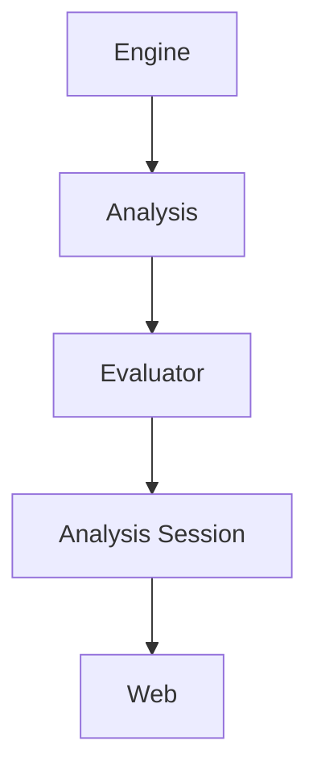
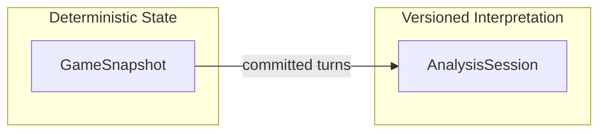
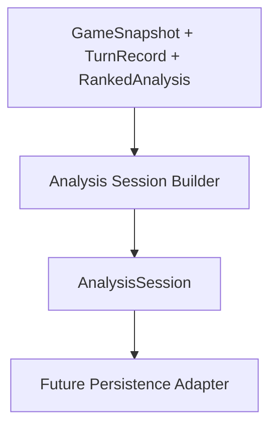
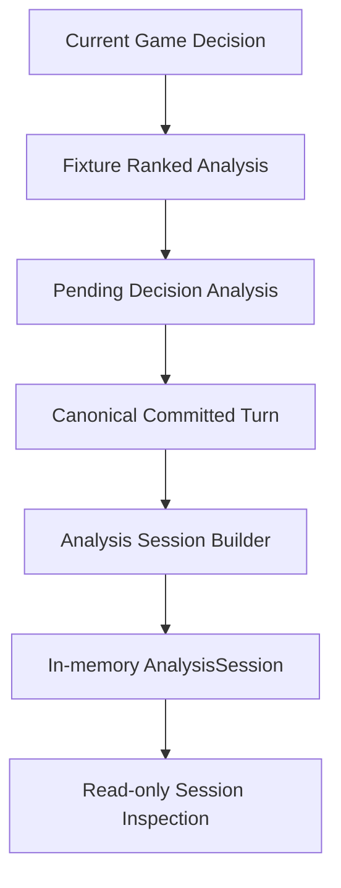

# Architecture Overview

## System boundaries

Backgammon Trainer starts as a pnpm workspace with four major boundaries:

1. **Deterministic game domain** (`packages/backgammon-domain`)
2. **Presentation layer** (`apps/web`)
3. **Application/server orchestration layer** (`apps/server`, future app-layer modules)
4. **AI gateway contracts** (`packages/ai-contracts`, with server adapters)

Structured deterministic analysis is now a dedicated package boundary:

5. **Position analysis layer** (`packages/backgammon-analysis`)
6. **Analysis session layer** (`packages/backgammon-analysis-session`)
7. **Coach conversation layer** (`packages/backgammon-coach`)
8. **Curated knowledge layer** (`packages/backgammon-knowledge`)

A narrow `packages/shared` package holds only small cross-cutting transport types.

## Dependency direction

Intended dependency direction:

- `apps/web` -> `packages/backgammon-domain`, `packages/backgammon-engine`, `packages/backgammon-analysis`, `packages/backgammon-analysis-session`, `packages/ai-contracts`, `packages/shared`
- `apps/web` -> `packages/backgammon-coach`
- `packages/backgammon-coach` -> `packages/backgammon-knowledge`
- `apps/server` -> `packages/ai-contracts`, `packages/shared`, optionally `packages/backgammon-domain`
- `packages/backgammon-analysis-session` -> `packages/backgammon-analysis`, `packages/backgammon-engine`
- `packages/backgammon-analysis` -> `packages/backgammon-engine`
- `packages/backgammon-coach` -> `packages/backgammon-analysis-session`, `packages/backgammon-analysis`, `packages/backgammon-engine`, `packages/ai-contracts`
- `packages/backgammon-knowledge` -> no app, UI, provider, or rules dependencies
- `packages/backgammon-evaluator-gnubg` -> `packages/backgammon-analysis`, `packages/backgammon-engine`, Node standard library
- `packages/ai-contracts` -> no backgammon package dependencies
- `packages/backgammon-domain` -> no app, UI, or provider code
- `packages/shared` -> no app, UI, or provider code

Core deterministic pipeline direction is now:

- `packages/backgammon-engine` -> `packages/backgammon-analysis` -> `packages/backgammon-analysis-session` -> future backend persistence -> future web persistence
- `packages/backgammon-analysis` -> `packages/backgammon-evaluator-gnubg` -> Node host layers

Move-outcome analysis pipeline boundary is:

- position + dice + active player
- engine complete legal moves (`getLegalMoves(...)`)
- analysis move outcomes (apply each legal move through engine + compute factual before/after)
- evaluator contract layer (provider-neutral score normalization, validation, deterministic ranking)
- coaching layer (`@backgammon-trainer/backgammon-coach`) for conversation context and prompt/evidence orchestration

Text coach pipeline boundary is:

- typed user message
- explicit question context resolution from app state
- deterministic evidence bundle generation with selected legal move rows
- optional replaceable knowledge retrieval boundary backed by local curated corpus in the current milestone
- provider-neutral `ChatModel` request/response
- trusted server execution boundary for real provider adapters
- text coach UI response rendering

Authoritative source policy remains explicit:

- engine for legal moves and board transitions
- analysis for factual features and ranked outputs
- analysis-session for committed-turn-linked interpretation records
- curated knowledge for general instructional guidance only
- model output is non-authoritative coaching text

Current-position recommendation authority policy is explicit:

- coach-domain evidence resolves recommendation support before model generation
- evaluator ranking claims are allowed only when supported by supplied evaluator coverage/provenance
- fixture evaluator provenance blocks authoritative strongest-move claims
- missing evaluator evidence and non-decision states block strongest-move claims

No package under `packages/` depends on React, Fastify, browser APIs, or vendor SDKs.

GNU Backgammon process execution is a stricter runtime boundary:

- `packages/backgammon-evaluator-gnubg` is Node-only
- browser bundles must not import that package or its `node:child_process` runner
- `apps/web` remains limited to no evaluator or explicit synthetic fixture evaluators

The factual analysis APIs intentionally remain machine-readable and non-prescriptive. Ranked outputs are isolated behind the evaluator contract boundary and require explicit evaluator provenance. Coaching prose generation remains out of scope.

Curated knowledge remains separate from deterministic facts:

- `packages/backgammon-knowledge` owns project-authored educational prose, taxonomy, validation, and deterministic local retrieval helpers
- `packages/backgammon-coach` owns which factual retrieval concepts are passed into the retriever and how retrieved guidance is combined with evidence
- future semantic retrieval can replace the current local matcher behind the coach retriever boundary without changing the coaching pipeline

## Architectural flow diagrams

High-level analysis flow:



Persistence and interpretation boundaries:



Analysis session persistence modeling is also intentionally separated from game-state persistence:

- `GameSnapshot` = deterministic engine game state and committed turn history
- `AnalysisSession` = versioned interpretation and evaluator-attributed analysis records

Analysis session construction now has an explicit domain builder boundary:

- `GameSnapshot` + canonical `TurnRecord` + ranked move analysis
- analysis-session builder orchestration (`createAnalysisSession`, `createAnalysisRecord`, `appendAnalysisRecord`, `reconcileAnalysisSession`)
- validated immutable `AnalysisSession`
- future persistence adapters (not yet implemented)

This separation allows analysis data to evolve independently from deterministic game rules and snapshot schemas.



Web capture orchestration now wires ranked fixture analysis to committed turns through an explicit pending-decision boundary:



Persistence boundaries remain intentionally separate:

```text
GameSnapshot persistence ─────── independent
AnalysisSession persistence ──── not implemented
```

## Repository guardrails

Architecture boundaries are enforced by lightweight repository checks:

- `pnpm architecture:check` validates forbidden workspace dependency edges and detects cycles.
- ESLint `no-restricted-imports` rules enforce package import boundaries and browser Node API restrictions.

See `docs/architecture/dependency-guardrails.md` for current rules.

Current web policy notes:

- analysis capture is development-only and fixture-backed
- committed turn history remains authoritative for chosen-move linkage
- capture failures never roll back committed game moves
- evaluator failures never block gameplay
- GNU adapter is not imported into the browser sandbox
- browser evaluator calls use provider-neutral server routes (`/api/evaluator/status`, `/api/evaluator/evaluate-position`)

Session policy notes:

- analysis sessions support sparse analyzed-turn sets (strictly ascending unique turn numbers with allowed gaps)
- append operations are immutable and idempotent for exact duplicate retry payloads
- reconciliation validates that stored analysis still matches committed deterministic game history

## Deterministic legal move requirement

Legal move evaluation must remain deterministic and testable. LLM output can be wrong, inconsistent, or drift over time. For training quality and trust, legality and board transitions must come from rules code with reproducible behavior, not generated text.

Dice randomness is intentionally kept in the web app layer (outside the rules engine) and passed into existing turn-state validation (`setDice(...)`). The UI roll helper supports random-source injection so tests can deterministically verify full game-loop behavior without introducing nondeterminism into engine rule logic.

Progressive move construction in the UI uses a staged-position model. The staged board is derived from a selected legal move prefix via engine projection APIs and is never treated as committed game state. This allows visual preview of multi-step turns, hits, bar-entry effects, and bearing-off effects while preserving the canonical committed state until `applyGameMove(...)` succeeds.

Standard opening-roll orchestration also remains in the web layer: White and Black opening dice are rolled in UI state, ties are rerolled explicitly, and the resolved opening dice are injected into the first engine `GameState` turn through `setDice(...)`.

Opening-roll dice ordering convention is explicit and stable: the dice tuple passed to engine turn state is `[whiteDie, blackDie]`. This ordering is preserved even when Black wins the opening roll; no sorting or winner-first reordering is applied.

## Canonical turn records and move history

Completed turns are now captured as immutable canonical turn records built from engine-domain types. Each record includes:

- sequential `turnNumber` (1, 2, 3, ...)
- acting player
- dice used for that committed turn
- explicit outcome (`move` with canonical `Move` metadata, or `pass`)
- `positionBefore` and `positionAfter`
- `gameStatusAfter`
- turn phase (`opening` or `normal`)

Ownership boundaries remain explicit:

- Engine package owns the reusable record shape and immutable record-construction helper.
- Web app owns in-memory history state and inspection interaction.
- No transient staged selection is persisted as turn history.
- Only successful committed transitions (`applyGameMove(...)` or `passTurn(...)`) append records.

History inspection reuses the main board in explicit inspection mode:

- selected record can be viewed as `before` or `after`
- board interaction and dice/pass/opening controls are disabled while inspecting
- live committed game state is preserved and restored on return
- staged selection is cleared when inspection begins to prevent mixed transient/live context

This model supports future replay, serialization, and portability without coupling record data to React component state, DOM APIs, or persistence-specific infrastructure.

## Why credentials require a server boundary

Any variable bundled by Vite into client code is public. Provider keys and model credentials must therefore remain server-only. The server mediates model calls, applies timeout controls, maps provider/transport failures to provider-neutral categories, and shields secrets from the browser.

Current real-provider slice uses OpenAI-compatible chat-completions protocol through trusted server configuration. Browser clients cannot supply arbitrary upstream provider URLs.

## Why provider-neutral AI contracts

The app should not couple to OpenAI/Anthropic/Google/local-model payloads. Provider-neutral request and response contracts make adapters swappable, support feature disparity through capability flags, and preserve a stable app-facing coaching interface.

## Why SVG is the likely board technology

A backgammon board needs precise, individually addressable elements: points, checkers, dice, highlights, legal targets, and annotations. SVG is a strong fit for this because it preserves semantic shape-level control, scales cleanly, and is straightforward to test with accessibility queries.

## Future local-first considerations

Current implementation uses versioned local snapshot persistence for committed game session restore. A likely future path is IndexedDB for richer local training history and replay beyond the current single-session snapshot model, with optional server sync later. Offline support remains incremental:

- Installable shell + static asset caching now
- Local training state persistence later
- Online coaching remains network-dependent unless explicit offline models are added

## Versioned game snapshots and local restore

The app now persists a durable game-session snapshot with explicit format/version metadata:

- format identifier: `backgammon-trainer-game`
- schema version: `1`

Durable snapshot boundary includes only committed session state:

- committed engine `GameState`
- canonical completed `TurnRecord[]`
- opening-roll lifecycle state needed to resume play coherently

Durable snapshot explicitly excludes transient React interaction state:

- selected source, selected staged steps, staged projection, hover destination
- breadcrumbs and candidate summaries
- history inspection selection
- manual dice form selection UI
- temporary status/error display strings

Ownership boundaries:

- Engine package owns canonical snapshot contracts, version-aware encode/decode APIs, runtime validation, and trusted immutable reconstruction.
- Web app owns browser storage integration (`localStorage`) behind a narrow adapter interface.
- UI never duplicates move legality or checker transition rules for persistence.

Restore and import behavior:

- Startup restore is atomic: either the full durable snapshot is accepted and restored, or the app stays on a safe fresh state.
- Import uses explicit user confirmation when replacing active progress.
- Invalid or unsupported snapshots are rejected with concise user-facing messages.

Immutability precision:

- Snapshot and turn-record reconstruction deep-clones nested values.
- Runtime `Object.freeze(...)` deep freezing is not applied.
- Immutability is structural copy plus non-mutating API conventions.
